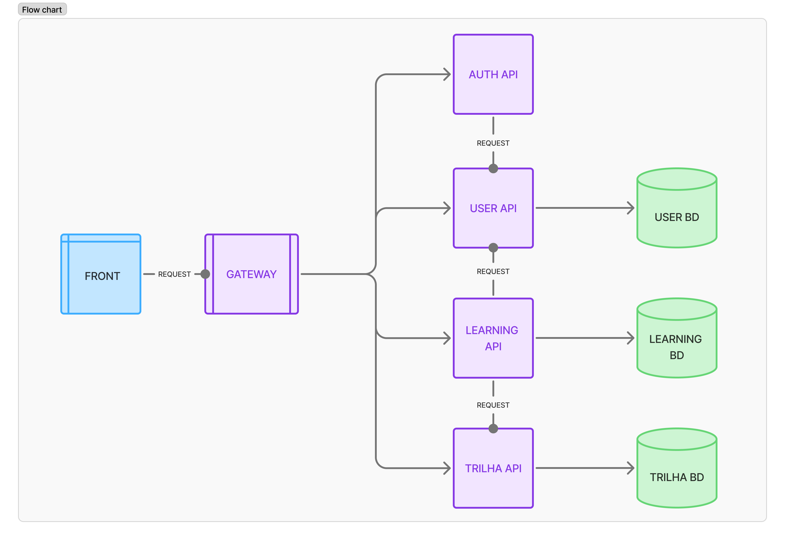

<p align="center" width="100%">
    
</p>

# Corvis - Trilha de Aprendizagem

**Corvis** é um sistema de trilhas de aprendizagem desenvolvido para auxiliar na gestão de trilhas de conhecimento. O sistema permite que usuários se inscrevam em trilhas, visualizem conteúdos e acompanhem seu progresso.

---

## Índice

- [Tecnologias Utilizadas](#tecnologias-utilizadas)
- [Estrutura do Projeto](#estrutura-do-projeto)
- [Mockups do Sistema](#mockups-do-sistema)
- [Funcionalidades Principais](#funcionalidades-principais)
- [Como Rodar com Docker](#como-rodar-com-docker)
  - [Pré-requisitos](#1-pré-requisitos)
  - [Clonando o repositório](#2-clonando-o-repositório)
  - [Subindo o projeto](#3-subindo-o-projeto)
  - [Acessando a aplicação](#4-acessando-a-aplicação)
  - [Usuário administrador padrão](#5-usuário-administrador-padrão)
  - [Comandos úteis](#6-comandos-úteis)
  - [Acessando o PostgreSQL](#7-acessando-o-postgresql)
- [Colaboradores](#colaboradores)

---

## Tecnologias Utilizadas

### Front-end

- **React**
- **JavaScript**
- **Tailwind CSS**
- **Figma**

### Back-end

- **Java**
- **Spring Boot**
- **JPA / Hibernate**
- **JWT**
- **Flyway**

### Banco de Dados

- **PostgreSQL**

### Infraestrutura

- **Docker**
- **Docker Compose**
- **Nginx**

---

## Estrutura do Projeto

Fluxograma que representa a estrutura do projeto e o fluxo de dados entre os componentes:



Modelagem de classes utilizada no sistema:


---

## Mockups do Sistema

Nosso projeto de design das telas do sistema pode ser acessado por [este link](https://www.figma.com/design/B7xvIZHp3pKfn6PnWCmGFw/Trilha-de-Aprendizagem?node-id=0-1&t=VMIaJwEpJmkwWkJq-1).


---

## Funcionalidades Principais

- Cadastro de trilhas de aprendizagem, módulos e conquistas
- Inscrição e acompanhamento de progresso por usuário
- API REST para gestão dos dados
- Interface web para visualização do progresso e trilhas disponíveis

---

## Como Rodar com Docker

### 1. Pré-requisitos

Instale:

- [Docker Desktop](https://www.docker.com/products/docker-desktop/)
- Git

Com o Docker Desktop aberto, confirme que o Docker está funcionando:

```bash
docker --version
docker compose version
```

### 2. Clonando o repositório

```bash
git clone --recurse-submodules https://github.com/BruBSilva/TrilhaDeAprendizadoApi_MS.git
cd TrilhaDeAprendizadoApi_MS
```

### 3. Subindo o projeto

Na raiz do projeto, execute:

```bash
docker compose up -d --build
```

Esse comando cria as imagens e sobe os containers:

- `postgres`
- `auth-service`
- `user-service`
- `learning-service`
- `trilha-service`
- `gateway-service`
- `front`

O arquivo `init-db.sql` cria os bancos `user-service`, `learning-service` e `trilha-service`. As tabelas são criadas automaticamente pelas migrations Flyway de cada serviço.

### 4. Acessando a aplicação

🖥️ Front-end:

```text
http://localhost:3000
```

Gateway da API:

```text
http://localhost:8080
```

Serviços individuais:

```text
user-service:     http://localhost:8081
learning-service: http://localhost:8082
trilha-service:   http://localhost:8083
auth-service:     http://localhost:8084
```

### 5. Usuário administrador padrão

Ao subir o `user-service`, uma migration Flyway cria automaticamente o administrador padrão:

```text
Nome:  Admin Master
Email: admmaster@teste.com
Role:  ADMIN
```

A senha cadastrada no banco está no campo `senha_hash`:

```text
0192023a7bbd73250516f069df18b500
```

### 6. Comandos úteis

Ver containers em execução:

```bash
docker compose ps
```

Ver logs de todos os serviços:

```bash
docker compose logs -f
```

Ver logs de um serviço específico:

```bash
docker compose logs -f user-service
```

Parar os containers:

```bash
docker compose down
```

Parar os containers e apagar o volume do banco de dados:

```bash
docker compose down -v
```

Use `docker compose down -v` quando quiser recriar o banco do zero. Isso apaga os dados salvos no volume `db-data`.

### 7. Acessando o PostgreSQL

Entrar no PostgreSQL:

```bash
docker compose exec postgres psql -U postgres
```

Entrar direto no banco do serviço de usuários:

```bash
docker compose exec postgres psql -U postgres -d "user-service"
```

Conferir o administrador padrão:

```sql
SELECT u.id, u.nome, u.email, u.role, (a.id IS NOT NULL) AS administrador
FROM public.usuarios u
LEFT JOIN public.administradores a ON a.id = u.id
WHERE u.email = 'admmaster@teste.com';
```

---

## Colaboradores

- [Ana Luiza - @nalusantana](https://github.com/nalusantana)
- [Bruna Borges - @BruBSilva](https://github.com/BruBSilva)
- [João Antonio - @Player07x](https://github.com/Player07x)
- [Vitória Silva - @vitoriasilva13](https://github.com/vitoriasilva13)

---

## Corvis

Este projeto é guiado pelo mestre corvo!.
