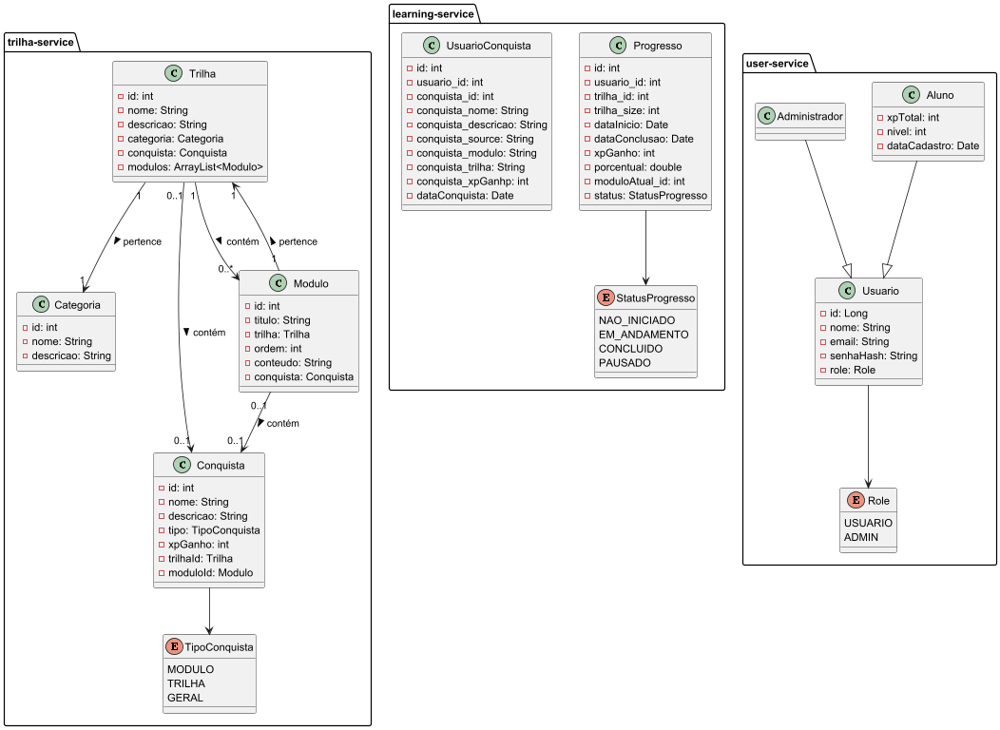

# Corvis - Trilha de Aprendizagem 📚

**Corvis** é um sistema de trilhas de aprendizagem desenvolvido para auxiliar na gestão de cursos e trilhas de conhecimento. O sistema permite que usuários se inscrevam em cursos, visualizem suas trilhas de aprendizagem e gerenciem seu progresso.

### O sistema permite que usuários:

- Se inscrevam em trilhas.
- Visualizem suas trilhas de aprendizagem e conclua módulos.
- Acompanhem e gerenciem seu progresso.

---

## 📑 Índice

- [Tecnologias Utilizadas](#-tecnologias-utilizadas)
- [Estrutura do Projeto](#-estrutura-do-projeto)
- [Funcionalidades Principais](#-funcionalidades-principais)
- [Instruções de Uso](#-instruções-de-uso)
- [Licença](#-licença)

---

## 🚀 Tecnologias Utilizadas

### Front-end
- **React**
- **JavaScript**
- **Tailwind CSS**

### Back-end
- **Java**
- **Spring Boot**
- **JPA / Hibernate**

### Banco de Dados
- **PostgreSQL**

---

## 🗂️ Estrutura do Projeto

Abaixo está um exemplo da modelagem de classes utilizada no sistema:



---

## ✅ Funcionalidades principais

- Cadastro de trilhas de aprendizagem, módulos e conquistas
- Inscrição e acompanhamento de progresso por usuário
- API REST para gestão dos dados
- Interface web para visualização do progresso e trilhas disponíveis.

---

## ⚡ Instruções de Uso

### 1. **Clonando o repositório**
Primeiro, clone o repositório para sua máquina local:

```bash
    git clone --recurse-submodules https://github.com/BruBSilva/TrilhaDeAprendizadoApi_MS.git
    cd TrilhaDeAprendizadoApi_MS
```
---

### 2. **Configuração do Banco de Dados**
Certifique-se de ter o PostgreSQL instalado e configurado e crie os seguintes bancos de dados:

```sql
    CREATE DATABASE trilha-service;
    CREATE DATABASE learning-service;
    CREATE DATABASE user-service;
```

Configure as credenciais de acesso ao banco de dados no arquivo `application.properties` de cada serviço:

```properties
    spring.datasource.url=jdbc:postgresql://localhost:[sua_porta]/trilha-service
    spring.datasource.username=seu_usuario
    spring.datasource.password=sua_senha
```

### 3. **Executando Front**

Para rodar o front-end, acesse o repositório 'front' e siga as instruções especificadas no arquivo `README.md`:

https://github.com/vitoriasilva13/front/

---

## 🐦‍⬛ Corvis

Este projeto é guiado por nosso corvo sábio.

---


